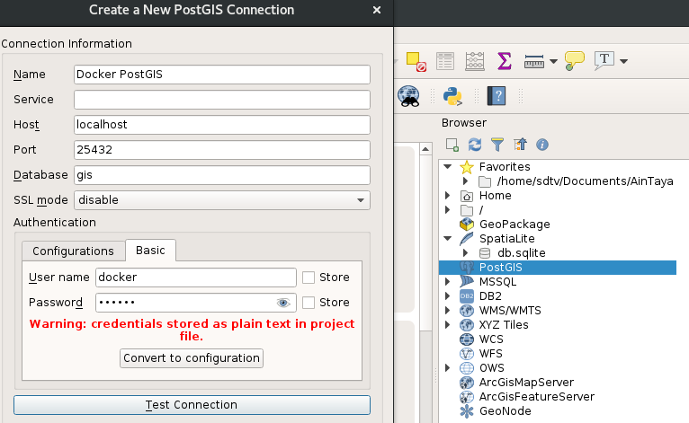

# Configuration and running of PostGIS/PostgreSQL/Geoserver on docker

This use case illustrate how to build a webmapping application using microservices architecture based on docker container technology

## Configuration of PostGIS/PostgreSQL

### Getting PostGIS image

Pull the image
``` 
docker pull kartoza/postgis
```

Check that the image is installed
```
docker container ls 
```
Should have 
```
CONTAINER ID        IMAGE               COMMAND                  CREATED           STATUS        PORTS                     NAMES
aaa  kartoza/postgis     "/bin/sh -c /docker-…"   ..ago      ... min       0.0.0.0:25432->5432/tcp   postgis
```

Run the image
```
docker run --name "postgis" -p 25432:5432 -d -t kartoza/postgis
```

Connect with psql (make sure you first install postgresql client tools on your host / client)
```
docker exec -it postgis psql -h localhost -U docker -p 25432 -l
```
**Note:** Default postgresql user is '**docker**' with password '**docker**'.

Or connect with QGIS (port : 25432)




To stop the container 
```
docker stop postgis
```

**For more commands** : [https://registry.hub.docker.com/r/kartoza/postgis](https://registry.hub.docker.com/r/kartoza/postgis)


### Storing data on the host rather than the container

```
mkdir -p ~/pgdata
docker run -d -v $HOME/pgdata:/var/lib/postgresql --name "postgis" -p 25432:5432 -d -t kartoza/postgis
```

Connect to the default **gis** database
```
docker exec -it postgis psql -h localhost -U docker -d gis
```

Within **psql** create a new database
```
CREATE DATABASE testgis;

-- to quit
\q
```


Connect to the default **testgis** database
```
docker exec -it postgis psql -h localhost -U docker -d testgis
```

Enable postgis extension

```
CREATE extension postgis;

-- Check the extension installation
SELECT postgis_full_version();
```

Create a table and add geometry column 
```
-- Create schema to hold data
CREATE SCHEMA gis_schema;

-- Create a new simple PostgreSQL table
CREATE TABLE gis_schema.points_table (id serial, num integer, name varchar);

\d  gis_schema.points_table;

-- Add a point using the old constraint based behavior
SELECT AddGeometryColumn ('gis_schema','points_table','geom',4326,'POINT',2, false);

\d  gis_schema.points_table;

-- to display all tables in the schema
\d  gis_schema.*;

-- to display all tables in all schemas
\d  *.*;

-- to quit
\q
```

Create a superuser and grant him the required privileges
```
CREATE USER gisadmin;
GRANT ALL PRIVILEGES ON DATABASE testgis TO gisadmin;

-- set user password
\password gisadmin
``` 
