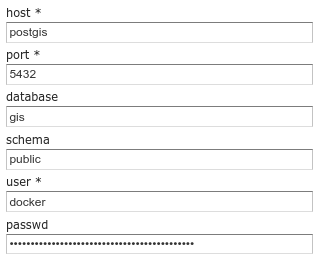

# Setting up Geoserver on docker

This use case illustrate how to deploy **geoserver** when building a webmapping application using microservices architecture based on docker container technology.

## Prerequisite 

- proper docker installation on the machine.

Optional :

- [Setup a PostGIS/PostgreSQL server on docker.](./postgis-on-docker.md) 

## Getting Geosever image

Pull the image
```bash 
docker pull kartoza/geoserver
```

Create an empty data directory to use to persist your data.
```bash
mkdir -p ~/geoserver_data && chmod -R a+rwx ~/geoserver_data
```

Run the image
```bash
docker run --name "geoserver" -v $HOME/geoserver_data:/opt/geoserver/data_dir/mydata -p 8080:8080 -d -t kartoza/geoserver
```

If you have a running **postgis** database, you can run the image with 
```bash
docker run --name "geoserver" -v $HOME/geoserver_data:/opt/geoserver/data_dir/mydata --link postgis:postgis -p 8080:8080 -d -t kartoza/geoserver
```

Point the browser to [http://localhost:8080/geoserver](http://localhost:8080/geoserver) and login using **admin/geoserver**

To connect to the **postgis** database, use the following parameters



# Configuration with nginx and dockerized geoserver

Add the following lines to your enabled site configuration file  ```/etc/nginx/sites-available/[your-site.com]```

```
location /geoserver/ {
    proxy_pass http://127.0.0.1:8080/geoserver/;
    proxy_pass_header Set-Cookie;
    proxy_set_header Host $host;
    proxy_set_header X-Forwarded-Proto $scheme;
    proxy_set_header X-Forwarded-For $proxy_add_x_forwarded_for;
}
```

Then test and reload nginx service
```bash
sudo nginx -t
sudo service nginx reload
```

# References : 

- [https://hub.docker.com/r/kartoza/geoserver/](https://hub.docker.com/r/kartoza/geoserver/)

